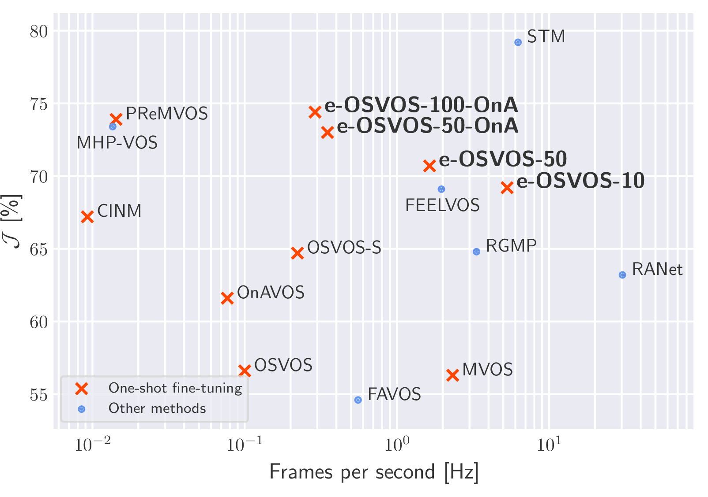

# Make One-Shot Video Object Segmentation Efficient Again

This repository provides the implementation of our **Make One-Shot Video Object Segmentation Efficient Again** ([Tim Meinhardt](https://dvl.in.tum.de/team/meinhardt/), [Laura Leal-Taixe](https://dvl.in.tum.de/team/lealtaixe/)) [paper](https://arxiv.org/abs/2012.01866) and includes the training and evaluation code for our efficient One-Shot Video Object Segmentation (**e-OSVOS**) approach.

<div align="center">
    
    
</div>
<div align="center">
    
</div>

## Installation

1. Clone and enter this repository:
    ```
    git clone git@github.com:dvl-tum/e-osvos.git
    cd e-osvos
    ```
2. Install packages for Python 3.7 in [virtualenv](https://uoa-eresearch.github.io/eresearch-cookbook/recipe/2014/11/26/python-virtual-env/):
    1. `pip3 install -r requirements.txt`
    2. Install DAVIS 2017 evaluation tool: `pip install https://github.com/timmeinhardt/davis-2017/archive/e-osvos.zip`
    3. Install PyTorch 1.2 and torchvision 0.4 for CUDA 9.2 from [here](https://pytorch.org/get-started/previous-versions/#v120).
3. Download and unpack datasets in the `data` directory:
    1. [DAVIS 2016](https://davischallenge.org/davis2016/code.html):
        ```
        wget https://graphics.ethz.ch/Downloads/Data/Davis/DAVIS-data.zip
        unzip DAVIS-data.zip -d DAVIS-2016
        ```
    2. [DAVIS 2017](https://davischallenge.org/davis2017/code.html):
        ```
        wget https://data.vision.ee.ethz.ch/csergi/share/davis/DAVIS-2017-trainval-480p.zip
        unzip DAVIS-2017-trainval-480p.zip -d DAVIS-2017
        ```
    3. For YouTube-VOS register [here](https://competitions.codalab.org/competitions/20127) and download the data into a `data/Youtube-VOS` directory. The `src/generate_youtube_vos_splits.py` script can be used to generate small random validation subsets of the training set.

3. Download and unpack pre-trained e-OSVOS model files in the `model` directory:
    ```
    wget https://vision.in.tum.de/webshare/u/meinhard/e-osvos_models.zip
    unzip e-osvos_models.zip
    ```
4. (Optional) Download and extract the Visdom training log files of the provided e-OSVOS model files into the `log` directory.
    ```
    wget https://vision.in.tum.de/webshare/u/meinhard/e-osvos_visdom_logs.zip
    unzip e-osvos_visdom_logs.zip
    ```

In order to configure, log and reproduce our computational experiments, we  structure our code with the [Sacred](http://sacred.readthedocs.io/en/latest/index.html) framework. For a detailed explanation of the Sacred interface please read its documentation.

## Train e-OSVOS

The training of e-OSVOS on meta tasks requires multiple GPUs. We implement a simultaneous meta learning on the training taskset and evaluation of multiple validation sets. The `datasets` and further configuration parameters can be found in `cfgs/meta.yaml`. In order to start a training run, we require an active Visdom server. The corresponding port and server parameters can be found in `cfgs/torch.yaml`.

The following command starts an e-OSVOS training with `meta_batch_size=4` on the combined YouTube-VOS and DAVIS 2017 training sets and evaluates on the validation set of DAVIS-2017. The evaluation requires a single GPU and the computation of the meta batch is distributed among the remaining GPUs, i.e., at least two 12 GB GPUs are needed. The following run will be logged in the `model` directory and as Visdom environment with the `YouTube-VOS+DAVIS-2017_some_descriptive_name_for_your_run` name:

```
python src/train_meta.py with \
    YouTube-VOS \
    env_suffix=some_descriptive_name_for_your_run
```

To improve results on DAVIS, we further fine-tune e-OSVOS to each individual dataset, e.g., for DAVIS 2017 by running:

```
python src/train_meta.py with \
    DAVIS-2017 \
    env_suffix=some_descriptive_name_for_your_run_DAVIS_2017_TRANSFER \
    meta_optim_model_file=models/YouTube-VOS+DAVIS-2017_train_dev_random_123/best_val_davis17_meta_iter.model \
    meta_optim_optim_cfg.log_init_lr_lr=0.0
```

## Evaluate e-OSVOS

We provide the exemplary evaluation code for e-OSVOS-100-OnA with 100 initial and 10 additional online adaption fine-tuning iterations every 5 frames. We achieve our state-of-the-art results with a fine-tuning batch size of 3 and online adaptation which requires at least a 16 GB GPU:
```
python src/train_meta.py with \
    DAVIS-2017 \
    env_suffix=some_descriptive_name_for_your_run_DAVIS_2017_EVAL \
    e-OSVOS-OnA \
    num_epochs.eval=100 \
    datasets.train.eval=False \
    meta_optim_model_file=models/DAVIS-2017_train_seqs/best_val_meta_iter.model
```
Adjusting the command above allows for a reproduction of the validation set results reported in the paper. For YouTube-VOS the predicted output files (`best_eval_preds` subdirectory) must be submitted to the official challenge [webpage](https://competitions.codalab.org/competitions/20127).

<center>

J                | DAVIS 2016    | DAVIS 2017 | YouTube-VOS
-------------    | ------------- | ---------  | -----------
e-OSVOS-10       | 85.1          | 69.2       |
e-OSVOS-50       | 85.5          | 70.7       |
e-OSVOS-50-OnA   | 85.9          | 73.0       | 71.4
e-OSVOS-100-OnA  | 86.6          | 74.4       |

</center>

## Publication
If you use this software in your research, please cite our publication:

```
@InProceedings{e_osvos_2020_NeurIPS,
    author = {Meinhardt, Tim and Leal{-}Taixe, Laura},
    title = {Make One-Shot Video Object Segmentation Efficient Again},
    booktitle = {Advances in Neural Information Processing Systems (NeurIPS)},
    month = {December},
    year = {2020}}
```
