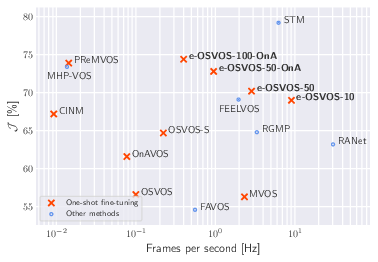

# Make One-Shot Video Object Segmentation Efficient Again

This repository provides the implementation of **Make One-Shot Video Object Segmentation Efficient Again** ([Tim Meinhardt](https://dvl.in.tum.de/team/meinhardt/), [Laura Leal-Taixe](https://dvl.in.tum.de/team/lealtaixe/)) [coming] and includes the training and evaluation code for our efficient One-Shot Video Object Segmentation (**e-OSVOS**) approach.

<p align="center">
  
</p>

## Installation

...

## Train e-OSVOS

...

## Evaluate e-OSVOS

...


## Publication
 If you use this software in your research, please cite our publication:

```
  @InProceedings{e_osvos_2020_NeurIPS,
  author = {Meinhardt, Tim and Leal{-}Taixe, Laura},
  title = {Make One-Shot Video Object Segmentation Efficient Again},
  booktitle = {Advances in Neural Information Processing Systems (NeurIPS)},
  month = {December},
  year = {2020}}
```