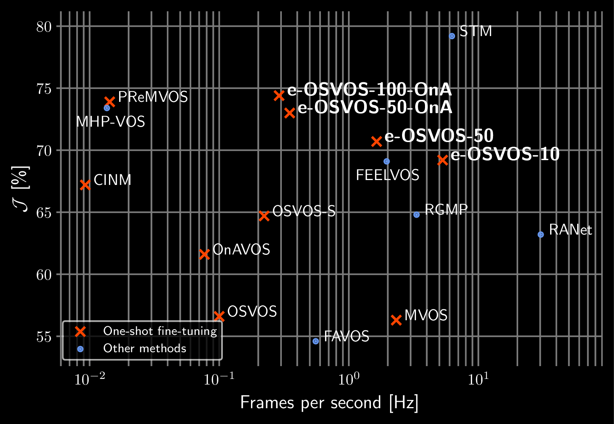
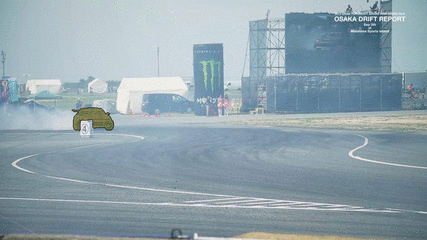

# Make One-Shot Video Object Segmentation Efficient Again

This repository provides the implementation of **Make One-Shot Video Object Segmentation Efficient Again** ([Tim Meinhardt](https://dvl.in.tum.de/team/meinhardt/), [Laura Leal-Taixe](https://dvl.in.tum.de/team/lealtaixe/)) [paper](https://arxiv.org/abs/2012.01866) and includes the training and evaluation code for our efficient One-Shot Video Object Segmentation (**e-OSVOS**) approach.

<div align="center">
    
</div>
<div align="center">
  
  
</div>

## Installation

1. Clone and enter this repository:
  ```
  git clone git@github.com:dvl-tum/e-osvos.git
  cd e-osvos
  ```

2. Install packages for Python 3.7 in [virtualenv](https://uoa-eresearch.github.io/eresearch-cookbook/recipe/2014/11/26/python-virtual-env/):
    1. `pip3 install -r requirements.txt`
    2. Install DAVIS 2017 evaluation tool: `pip install https://github.com/timmeinhardt/davis-2017/archive/e-osvos.zip`
    3. Install PyTorch 1.2 and torchvision 0.4 for CUDA 9.2 from [here](https://pytorch.org/get-started/previous-versions/#v120).
3. Download and unpack datasets in the `data` directory:
    1. [DAVIS 2016](https://davischallenge.org/davis2016/code.html):
      ```
      wget https://graphics.ethz.ch/Downloads/Data/Davis/DAVIS-data.zip
      unzip -d DAVIS-data.zip DAVIS-2016.zip
      ```
    2. [DAVIS 2017](https://davischallenge.org/davis2017/code.html):
      ```
      wget https://data.vision.ee.ethz.ch/csergi/share/davis/DAVIS-2017-trainval-480p.zip
      unzip -d DAVIS-2017-trainval-480p.zip DAVIS-2017.zip
      ```
    3. For YouTube-VOS register [here](https://competitions.codalab.org/competitions/20127) and download the data into a `data/Youtube-VOS` directory.

3. Download and unpack pre-trained **e-OSVOS** model files in the `model` directory:

In order to configure, log and reproduce our computational experiments, we  structure our code with the [Sacred](http://sacred.readthedocs.io/en/latest/index.html) framework. For a detailed explanation of the Sacred interface please read its documentation.

## Train e-OSVOS

The training of e-OSVOS on meta tasks requires multiple GPUs. We implement a simultaneous meta learning on the training taskset and evaluation of multiple validation sets. The `datasets` and further configuration parameters can be found in `cfgs/meta.yaml`. In order to start a training run, we require an active Visdom server. The corresponding port and server parameters can be found in `cfgs/torch.yaml`.

The following command starts an e-OSVOS training with `meta_batch_size=4` on the combined YouTube-VOS and DAVIS 2017 training sets and evaluates on the validation set of DAVIS-2017. The evaluation requires a single GPU and the computation of the meta batch is distributed among the remaining GPUs, i.e., at least two 12 GB GPUs are needed.

```
python src/train_meta.py with \
    YouTube-VOS \
    env_suffix=some_descriptive_name_for_your_run \
    torch_cfg.vis.port=8092 \
    torch_cfg.vis.server=http://localhost
```

## Evaluate e-OSVOS

...


## Publication
 If you use this software in your research, please cite our publication:

```
  @InProceedings{e_osvos_2020_NeurIPS,
  author = {Meinhardt, Tim and Leal{-}Taixe, Laura},
  title = {Make One-Shot Video Object Segmentation Efficient Again},
  booktitle = {Advances in Neural Information Processing Systems (NeurIPS)},
  month = {December},
  year = {2020}}
```